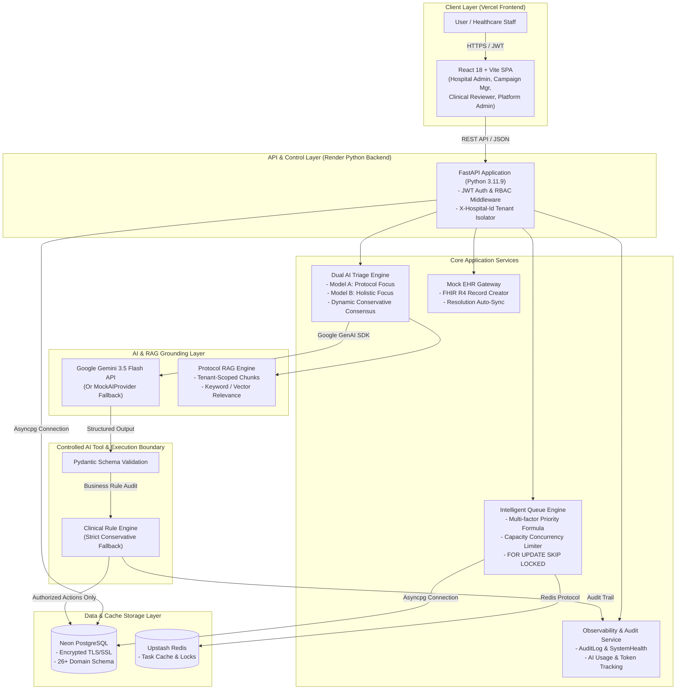

# PostCare Architecture & System Design Document

*(For the complete submission documentation index, visit [`docs/final/INDEX.md`](./docs/final/INDEX.md) and [`docs/final/ARCHITECTURE.md`](./docs/final/ARCHITECTURE.md))*

## 1. System Overview

**PostCare** is a production-ready, multi-tenant AI-assisted healthcare outreach and clinical escalation platform. It enables hospital systems to manage post-discharge patient outreach campaigns, automate AI voice intake and triage, apply strict multi-model consensus to clinical assessments, and escalate concerning patient cases to human clinical reviewers with automated Mock EHR (FHIR R4) synchronization.

---

## 2. Master System Architecture Diagram

---

## 3. Core Architectural Principles

1. **Multi-Tenancy**: Every data entity and query is strictly isolated by `hospital_id`.
2. **Deterministic Guardrails**: AI models generate structured JSON predictions, which are validated by Pydantic schemas and evaluated by a strict conservative rule engine.
3. **Capacity & Concurrency**: Outreach task allocation uses `FOR UPDATE SKIP LOCKED` and respects hospital capacity limits.
4. **Resilience & Recovery**: Automatic stale task recovery for worker failures, exponential backoff retries, and fallback to Mock AI on quota exhaustion.
