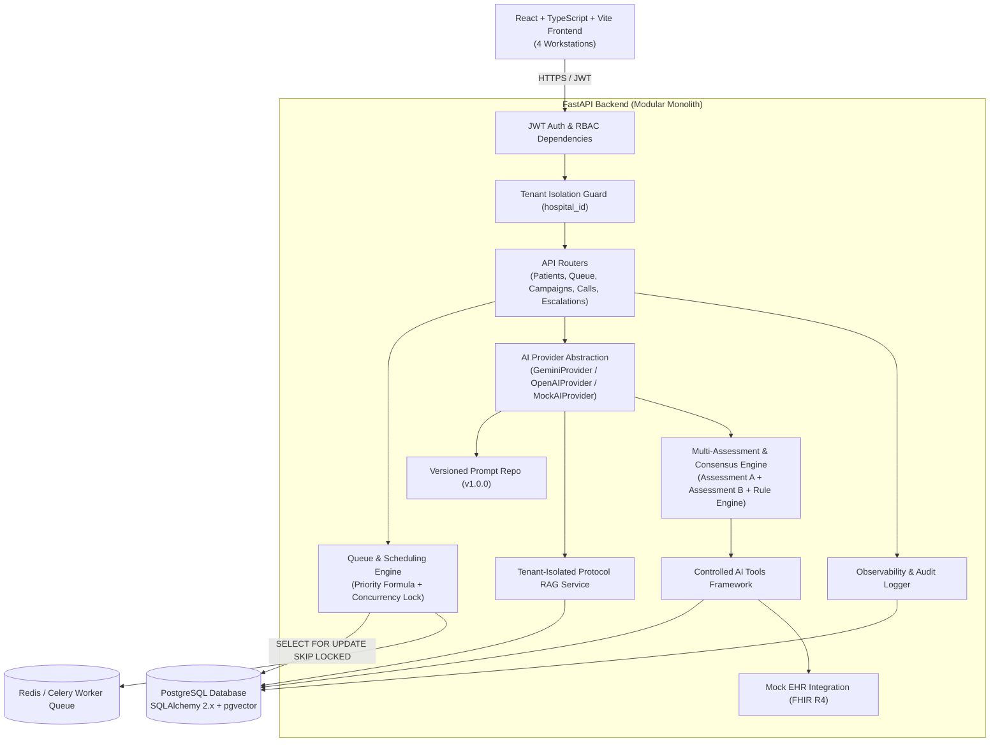

# Architecture Documentation (ARCHITECTURE.md)

## System Overview & Component Diagram

The **Multi-Hospital Post-Discharge Outreach Platform** is built as a production-oriented modular monolith designed for multi-tenant isolation, capacity-aware concurrency queueing, dual AI consensus triage, and clinical human-in-the-loop escalation.

## Architectural Boundaries

1. **Multi-Tenancy & Authorization Boundary**:
   - Every database query and background worker task carries an explicit `hospital_id` filter.
   - Frontend passes `X-Hospital-Id` header (or reads from JWT user context).
   - Zero cross-tenant data retrieval across hospitals.

2. **Queue Concurrency Boundary**:
   - Outbound calling capacity is strictly limited per hospital tenant (e.g. 10 concurrent calls).
   - Database level `SELECT ... FOR UPDATE SKIP LOCKED` guarantees two workers never reserve the same slot or exceed capacity.

3. **AI Control Boundary**:
   - AI models NEVER directly touch database tables.
   - All side effects (escalation creation, callback scheduling, EHR sync) execute via `ControlledTools` with schema validation, business rule checks, and audit logging.

4. **Clinical Safety Consensus Boundary**:
   - Dual AI assessments (Assessment A & B) plus a clinical Rule Engine operate independently.
   - Under `STRICT_CONSERVATIVE` consensus policy, any indication of `URGENT`, `CONCERNING`, or `UNCERTAIN` triggers mandatory human escalation.
