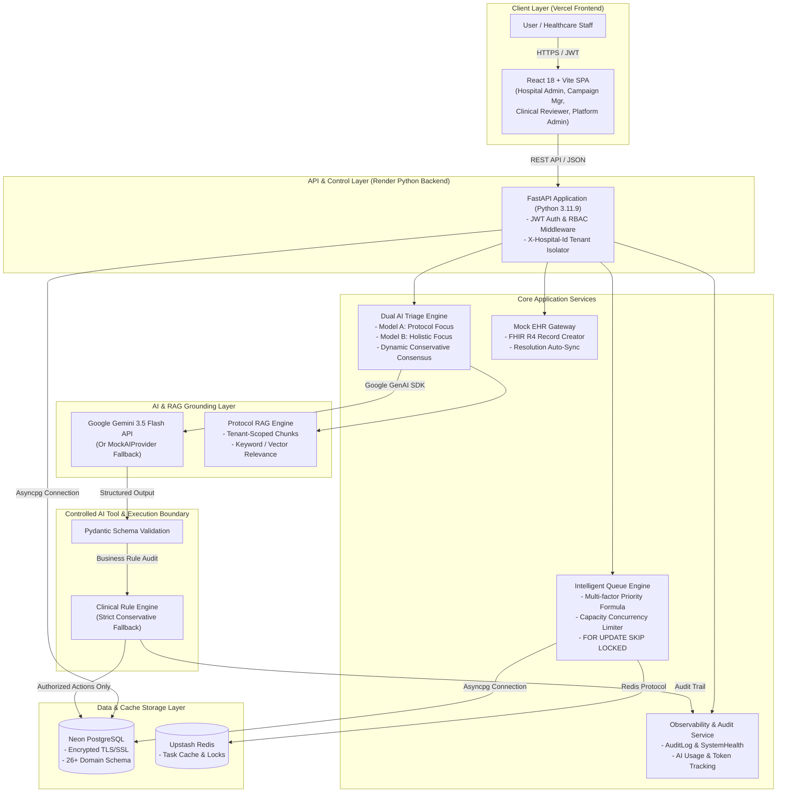

# PostCare Architecture & System Design Document

## 1. System Overview

**PostCare** is a production-ready, multi-tenant AI-assisted healthcare outreach and clinical escalation platform. It enables hospital systems to manage post-discharge patient outreach campaigns, automate AI voice intake and triage, apply strict multi-model consensus to clinical assessments, and escalate concerning patient cases to human clinical reviewers with automated Mock EHR (FHIR R4) synchronization.

---

## 2. Master System Architecture Diagram

---

## 3. Frontend Architecture

- **Technology Stack**: React 18, TypeScript, Vite, Vanilla CSS + Tailwind utility classes, Lucide icons.
- **Role-Based Views**:
  1. **Hospital Admin (`/hospital`)**: Operational overview, patient list, discharge records, clinical protocols, EHR gateway status.
  2. **Campaign Manager (`/campaigns`)**: Outreach campaign management, live call queue simulation, priority distribution, manual callback triggers.
  3. **Clinical Reviewer (`/review`)**: Escalation inbox, dual AI assessment comparison, consensus rationale, RAG evidence view, reviewer action buttons (Acknowledge, Request Info, Resolve & Sync EHR).
  4. **Platform Admin (`/admin`)**: Multi-hospital platform metrics, audit log timeline, real-time system health, runnable Safety Evaluation benchmark.
- **API Integration**: Centralized HTTP client ([`frontend/src/services/api.ts`](file:///c:/Users/CSE/Desktop/PostCare/frontend/src/services/api.ts)) with environment-driven `VITE_API_BASE_URL`, automatic JWT header injection, and `X-Hospital-Id` tenant isolation header propagation.

---

## 4. Backend Architecture

- **Technology Stack**: Python 3.11.9, FastAPI 0.110+, AsyncSQLAlchemy 2.0, Pydantic v2, Uvicorn.
- **Modular Directory Structure**:
  - `app/api/v1/`: API endpoints (`auth`, `hospitals`, `patients`, `campaigns`, `queue`, `calls`, `escalations`, `ehr`, `protocols`, `observability`, `evaluation`).
  - `app/core/`: Configuration (`config.py`), Database engine normalization ([`database.py`](file:///c:/Users/CSE/Desktop/PostCare/backend/app/core/database.py)), Auth/Security (`security.py`), Dependencies (`dependencies.py`).
  - `app/models/`: SQLAlchemy declarative domain models ([`domain.py`](file:///c:/Users/CSE/Desktop/PostCare/backend/app/models/domain.py)).
  - `app/queue/`: Intelligent queue and concurrency engine ([`queue_engine.py`](file:///c:/Users/CSE/Desktop/PostCare/backend/app/queue/queue_engine.py)).
  - `app/ai/`: Provider abstractions, Gemini integration, dual prompt definitions, consensus engine.
  - `app/rag/`: Protocol retrieval and grounding service ([`protocol_rag.py`](file:///c:/Users/CSE/Desktop/PostCare/backend/app/rag/protocol_rag.py)).
  - `app/evaluation/`: 25-scenario deterministic safety evaluation benchmark.

---

## 5. Database Architecture

- **Primary Database**: PostgreSQL (Neon PostgreSQL in production with enforced SSL; SQLite `sqlite+aiosqlite` for local dev/testing).
- **OR Mapping**: AsyncSQLAlchemy 2.0 with 26+ domain entities:
  - `Hospital`, `User`, `Patient`, `Encounter`, `Discharge`, `Condition`, `Observation`, `Medication`, `CarePlan`, `Procedure`, `Campaign`, `CampaignEligibility`, `OutreachTask`, `Call`, `Conversation`, `Protocol`, `KnowledgeDocument`, `KnowledgeChunk`, `TriageAssessment`, `EscalationAssessment`, `ConsensusDecision`, `Escalation`, `Documentation`, `EHRRecord`, `Notification`, `Event`, `AuditLog`, `AIUsage`, `SystemHealth`.
- **Initialization**: Non-destructive schema initialization via [`python -m app.scripts.init_prod_db`](file:///c:/Users/CSE/Desktop/PostCare/backend/app/scripts/init_prod_db.py) and safe idempotent demo seeding via [`python -m app.scripts.seed_prod_demo`](file:///c:/Users/CSE/Desktop/PostCare/backend/app/scripts/seed_prod_demo.py).

---

## 6. Queue & Capacity Architecture

- **Implementation**: [`QueueEngine`](file:///c:/Users/CSE/Desktop/PostCare/backend/app/queue/queue_engine.py) manages task reservation and lifecycle.
- **Concurrency Control**: Concurrency is enforced per hospital (`Hospital.max_concurrent_calls`). Workers reserve task candidates using PostgreSQL `FOR UPDATE SKIP LOCKED`.
- **Priority Scoring**:
  $$\text{Priority} = \text{BaseRisk} + \text{DeadlinePressure} + \text{CallbackUrgency} + (\text{CampaignPriority} \times 5) + \text{Aging} - \text{RetryPenalty}$$
- **Retry Strategy**: Exponential backoff delays (Attempt 1: 15m, Attempt 2: 60m, Attempt 3: 240m). Tasks exceeding max attempts transition to `MANUAL_FOLLOW_UP`.

---

## 7. AI & Consensus Architecture

- **Dual Triage Pipeline**: Executes two independent AI assessments for every outreach call:
  - **Assessment A**: Focused on strict clinical protocol rules and red flags.
  - **Assessment B**: Focused on holistic patient context, symptom progression, and psychosocial factors.
- **Dynamic Conservative Consensus**:
  - If both models agree on `ROUTINE`, case outcome is `ROUTINE`.
  - If either model detects `CONCERNING`, `URGENT`, or `UNCERTAIN`, or if the two models disagree, the consensus engine applies the **strict conservative policy**: escalating to highest severity (`URGENT` / `CONCERNING`) and creating a Clinical Escalation.

---

## 8. Controlled AI Tool Boundary & Security

AI models in PostCare **never** have direct database or network access. All AI interactions pass through a strict security boundary:

1. **Prompt Invocation**: System instructions enforce structured JSON schema compliance.
2. **Schema Validation**: Pydantic validates AI JSON responses. Malformed outputs trigger automated retries.
3. **Business Rule Audit**: The backend evaluates predictions against deterministic clinical rules.
4. **Execution & Audit**: Database writes (escalations, assessments, audit logs) are performed strictly by authenticated backend service handlers.

---

## 9. Multi-Tenancy Boundary

- **Isolation Mechanism**: Every database table includes a `hospital_id` foreign key.
- **API Middleware**: Requests pass through `get_tenant_hospital_id`, extracting `X-Hospital-Id` or user JWT `hospital_id`.
- **Data Filtering**: Database queries and RAG vector/chunk searches strictly append `where(Model.hospital_id == hospital_id)`.

---

## 10. Authentication & RBAC

- **Authentication**: OAuth2 password flow issuing HS256 JWT tokens.
- **Role Hierarchy**:
  - `HOSPITAL_ADMIN`: Full operational and patient scope within assigned hospital.
  - `CAMPAIGN_MANAGER`: Campaign creation, execution, and call queue monitoring.
  - `CLINICAL_REVIEWER`: Escalation triage, documentation review, and EHR resolution.
  - `PLATFORM_ADMIN`: Cross-hospital platform health, audit log inspection, and safety evaluation benchmarking.

---

## 11. Production Deployment Setup

- **Frontend**: Vercel Single-Page Application (`VITE_API_BASE_URL`).
- **Backend**: Render Python Web Service (Python 3.11.9, Uvicorn server).
- **Database**: Neon PostgreSQL with `sslmode=require` (TLS connection handled by URL parser in [`database.py`](file:///c:/Users/CSE/Desktop/PostCare/backend/app/core/database.py)).
- **Redis**: Upstash Redis for task queue caching and rate limiting.
- **AI Provider**: Google Gemini API (`gemini-3.5-flash`).
