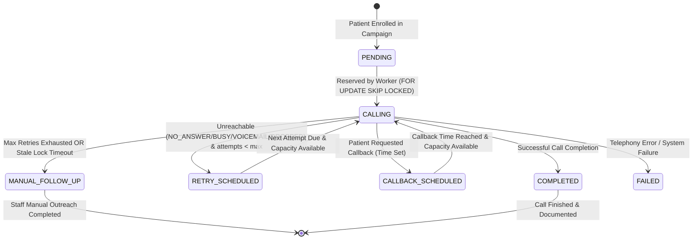

# PostCare Intelligent Queue & Scheduling Architecture

## 1. Queue Purpose & Overview

The **PostCare Intelligent Queue Engine** ([`backend/app/queue/queue_engine.py`](file:///c:/Users/CSE/Desktop/PostCare/backend/app/queue/queue_engine.py)) is a capacity-aware, multi-factor prioritization engine for automated post-discharge patient outreach. It ensures that high-risk cardiac and surgical patients are contacted promptly, clinical cutoffs are met, explicit callbacks are prioritized, starvation of lower-priority cases is prevented, and hospital concurrency limits are respected without race conditions.

---

## 2. Task Lifecycle & State Machine



### Task State Enums (`TaskStateEnum`)
- `PENDING`: Initial state when task is created.
- `CALLING`: Currently locked and actively being called by a worker thread/process.
- `COMPLETED`: Call successfully finished and processed.
- `RETRY_SCHEDULED`: Failed attempt (unreachable); scheduled for retry with exponential backoff.
- `CALLBACK_SCHEDULED`: Patient requested call at a specific future timestamp.
- `MANUAL_FOLLOW_UP`: Retries exhausted or clinical cutoff breached; transferred to human staff.
- `FAILED`: Unrecoverable execution failure.

---

## 3. Exact Priority Calculation Formula

The queue dynamically ranks candidate tasks before worker reservation using the multi-factor priority algorithm implemented in `QueueEngine.calculate_priority_score()`:

$$\text{Priority Score} = \text{BaseRisk} + \text{DeadlinePressure} + \text{CallbackUrgency} + (\text{CampaignPriority} \times 5) + \text{Aging} - \text{RetryPenalty}$$

### Code Specification ([`queue_engine.py:L28-L71`](file:///c:/Users/CSE/Desktop/PostCare/backend/app/queue/queue_engine.py#L28-L71))

```python
def calculate_priority_score(
    self,
    risk_tier: str,
    created_at: datetime,
    clinical_cutoff_at: Optional[datetime],
    scheduled_callback_at: Optional[datetime],
    campaign_priority: int,
    attempt_count: int
) -> float:
    now = datetime.utcnow()
    
    # 1. Base Clinical Risk Score
    risk_scores = {"URGENT": 40.0, "HIGH": 30.0, "MEDIUM": 15.0, "LOW": 5.0}
    score = risk_scores.get(risk_tier.upper(), 10.0)
    
    # 2. Deadline Pressure (Surges as clinical cutoff approaches)
    if clinical_cutoff_at:
        hours_remaining = (clinical_cutoff_at - now).total_seconds() / 3600.0
        if hours_remaining <= 0:
            score += 50.0  # Overdue cutoff
        elif hours_remaining <= 6:
            score += 40.0
        elif hours_remaining <= 12:
            score += 25.0
        elif hours_remaining <= 24:
            score += 10.0
            
    # 3. Callback Urgency
    if scheduled_callback_at:
        time_diff = (now - scheduled_callback_at).total_seconds() / 60.0
        if time_diff >= 0:
            score += 45.0  # Callback due or overdue
            
    # 4. Campaign Priority Weight (0 - 50 points)
    score += float(campaign_priority * 5)
    
    # 5. Waiting Time Aging (Prevents Starvation: +2 points per waiting hour, max 30)
    hours_waiting = (now - created_at).total_seconds() / 3600.0
    score += min(hours_waiting * 2.0, 30.0)
    
    # 6. Retry Penalty (-5 points per failed attempt to prioritize fresh calls)
    score -= float(attempt_count * 5.0)
    
    return round(score, 2)
```

---

## 4. Concurrency Control & Row Locking

- **Capacity Limiting**: Active calling count is checked against `Hospital.max_concurrent_calls` before reserving work.
- **Row Locking**: Task reservation uses `SELECT FOR UPDATE SKIP LOCKED` on PostgreSQL:
  ```python
  stmt = select(OutreachTask).join(Campaign).where(
      OutreachTask.hospital_id == self.hospital_id,
      Campaign.status == CampaignStatusEnum.RUNNING,
      OutreachTask.state.in_([TaskStateEnum.PENDING, TaskStateEnum.RETRY_SCHEDULED, TaskStateEnum.CALLBACK_SCHEDULED]),
      or_(OutreachTask.next_attempt_at.is_(None), OutreachTask.next_attempt_at <= now)
  ).order_by(OutreachTask.priority_score.desc()).with_for_update(skip_locked=True).limit(1)
  ```
- **Concurrency Isolation**: Multiple worker processes/threads can run concurrently without double-calling any patient or experiencing lock contention delays.

---

## 5. Retry Strategy & Exponential Backoff

When an outreach call attempt fails due to non-response (`NO_ANSWER`, `BUSY`, `VOICEMAIL`, `DROPPED`):
1. `attempt_count` is incremented.
2. If `attempt_count >= max_attempts` (default 3):
   - Task transitions to `MANUAL_FOLLOW_UP`.
   - A staff dashboard `Notification` is created automatically.
3. Otherwise, task transitions to `RETRY_SCHEDULED` with exponential backoff:
   - **Attempt 1 Failure**: Delay 15 minutes (`now + 15m`).
   - **Attempt 2 Failure**: Delay 60 minutes (`now + 60m`).
   - **Attempt 3 Failure**: Delay 240 minutes (`now + 240m`).

---

## 6. Worker Crash Recovery

- **Stale Lock Detector**: `QueueEngine.recover_stale_tasks(timeout_minutes=5)` runs automatically before every task reservation.
- **Recovery Action**: If a worker crashes or loses network connectivity while holding a task in `CALLING` state for > 5 minutes:
  - Task lock is released (`worker_id = None`, `locked_at = None`).
  - Task attempt count is incremented.
  - Task is reset to `RETRY_SCHEDULED` or `MANUAL_FOLLOW_UP`.

---

## 7. Interactive Simulation API

The API endpoint `POST /api/v1/queue/simulate_step` allows testing and evaluation of queue execution:
- Reserves the next highest priority task using `FOR UPDATE SKIP LOCKED`.
- Simulates call execution and processes outcomes (`COMPLETED`, `NO_ANSWER`, `BUSY`, `CALLBACK_REQUESTED`).
- Updates task state, logs system audit entries, and returns detailed JSON step execution status.
